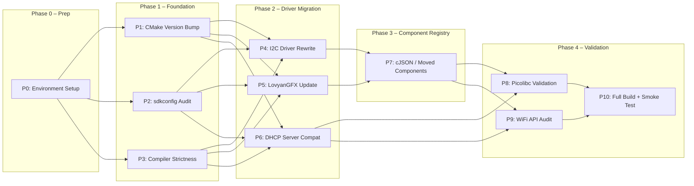

# FlxOS — ESP-IDF v5.5.4 → v6.0.0 Migration Plan

> **Target:** ESP-IDF v6.0.0 (GCC 15.1.0 toolchain)
> **Source:** ESP-IDF v5.5.4
> **Date:** 2026-04-26
> **Status:** 🔨 Build Complete — Hardware Smoke Test Pending

> [!IMPORTANT]
> The `dependencies.lock` already references `version: 6.0.0`, meaning `idf.py` may have been partially switched. A **full clean build** from scratch is mandatory before starting.

---

## Executive Summary

This migration touches **10 workstreams** across the FlxOS codebase. The most impactful changes are:

1. **Legacy I2C driver rewrite** — `EspI2cBus.cpp` uses the fully-deprecated `driver/i2c.h` command-link API
2. **LovyanGFX submodule update** — must be updated to a v6-compatible commit
3. **cJSON removal from IDF core** — no direct usage found, but transitive dependency via `esp_http_client` etc. needs verification
4. **Compiler strictness** — GCC 15 + `-Werror` by default will surface new warnings
5. **Picolibc as default libc** — mostly transparent, but needs validation
6. **UART driver EOL tracking** — still available but should be noted for future



---

## Phase 0 — Environment Setup

### P0: Install IDF v6.0.0 & Clean Workspace

| Attribute | Value |
|-----------|-------|
| **Effort** | 15 min |
| **Risk** | Low |
| **Files** | None (environment only) |

**Steps:**
1. Install ESP-IDF v6.0.0 via `install.sh` or VS Code extension
2. Source the new `export.sh` — verify `idf.py --version` reports `6.0.0`
3. Verify toolchain: `xtensa-esp32s3-elf-gcc --version` → should show GCC 15.1.0
4. Delete the entire `build/` directory: `rm -rf build/`
5. Delete `sdkconfig` (will be regenerated from `sdkconfig.defaults` + `sdkconfig.profile`)
6. Delete `managed_components/` (will be re-fetched)
7. Delete `dependencies.lock` (will be regenerated)

```bash
rm -rf build/ sdkconfig managed_components/ dependencies.lock
idf.py set-target esp32s3
```

---

## Phase 1 — Foundation (Build System & Config)

### P1: CMake Minimum Version Bump

| Attribute | Value |
|-----------|-------|
| **Effort** | 5 min |
| **Risk** | None |
| **Files** | [CMakeLists.txt](file:///home/akash/flxos-labs/flxos/CMakeLists.txt) |

IDF v6.0 requires CMake ≥ 3.22.1. FlxOS currently specifies `3.16`.

**Change:**
```diff
-cmake_minimum_required(VERSION 3.16)
+cmake_minimum_required(VERSION 3.22.1)
```

> [!NOTE]
> This is a one-line change. The LVGL and LovyanGFX submodule CMakeLists specify their own minimum versions internally and don't need modification.

---

### P2: sdkconfig Audit

| Attribute | Value |
|-----------|-------|
| **Effort** | 30 min |
| **Risk** | Medium |
| **Files** | [sdkconfig.defaults](file:///home/akash/flxos-labs/flxos/sdkconfig.defaults), [sdkconfig.profile](file:///home/akash/flxos-labs/flxos/sdkconfig.profile), [profile.cmake](file:///home/akash/flxos-labs/flxos/Buildscripts/profile.cmake) |

Several Kconfig symbols may have been renamed, moved, or removed in v6.0. A systematic audit is required.

#### P2-A: Config keys to verify/update

| Config Key | Status in v6.0 | Action |
|-----------|----------------|--------|
| `CONFIG_COMPILER_OPTIMIZATION_PERF` | ✅ Likely retained | Verify |
| `CONFIG_ESP_DEFAULT_CPU_FREQ_MHZ_240` | ✅ Likely retained | Verify |
| `CONFIG_FREERTOS_HZ` | ✅ Retained | None |
| `CONFIG_FREERTOS_VTASKLIST_INCLUDE_COREID` | ⚠️ May be renamed | Check menuconfig |
| `CONFIG_FREERTOS_GENERATE_RUN_TIME_STATS` | ✅ Retained | None |
| `CONFIG_FREERTOS_USE_APPLICATION_TASK_TAG` | ⚠️ Check rename | Verify |
| `CONFIG_IDF_EXPERIMENTAL_FEATURES` | ⚠️ Check if still exists | Some features may have graduated |
| `CONFIG_COMPILER_CXX_RTTI` | ✅ Should be retained | Verify |
| `CONFIG_SPIRAM_USE_MALLOC` | ⚠️ May have changed | Verify SPIRAM config tree |
| `CONFIG_ESP32S3_INSTRUCTION_CACHE_32KB` | ⚠️ May be renamed to chip-agnostic | Verify |
| `CONFIG_ESP32S3_DATA_CACHE_64KB` | ⚠️ Same concern | Verify |
| `CONFIG_ESP32S3_DATA_CACHE_LINE_64B` | ⚠️ Same concern | Verify |
| `CONFIG_WL_SECTOR_SIZE_512` | ✅ Likely retained | Verify |
| `CONFIG_SPI_FLASH_SIZE_OVERRIDE` | ✅ Likely retained | Verify |

#### P2-B: Approach

1. Run `idf.py menuconfig` after Phase 0 cleanup
2. Check for any `CONFIG_xxx is obsolete` warnings in the build output
3. Cross-reference against the [ESP-IDF v6.0 Release Notes Database](https://docs.espressif.com/) filtering by "Breaking Changes"
4. Update `sdkconfig.defaults` and the `_flx_generate_sdkconfig_frag()` function in `profile.cmake`

> [!WARNING]
> The SPIRAM config tree (`CONFIG_SPIRAM_*`) has undergone restructuring in some IDF releases. Pay special attention to `CONFIG_SPIRAM_USE_MALLOC`, `CONFIG_SPIRAM_TRY_ALLOCATE_WIFI_LWIP`, and `CONFIG_SPIRAM_ALLOW_STACK_EXTERNAL_MEMORY`.

---

### P3: Compiler Warnings → Errors (GCC 15)

| Attribute | Value |
|-----------|-------|
| **Effort** | 1–3 hours (depends on warning count) |
| **Risk** | Medium-High |
| **Files** | All `.cpp` / `.c` / `.h` / `.hpp` in the project |

IDF v6.0 enables `-Werror` by default (all warnings become errors). GCC 15.1.0 is also stricter.

**Strategy:**
1. **First pass:** Temporarily add `CONFIG_COMPILER_DISABLE_DEFAULT_ERRORS=y` to `sdkconfig.defaults` to get a successful build
2. **Collect warnings:** Build with errors disabled, capture the full warning log
3. **Fix incrementally:** Address warnings module-by-module
4. **Remove escape hatch:** Delete `CONFIG_COMPILER_DISABLE_DEFAULT_ERRORS=y` when clean

**Common GCC 15 issues to expect:**
- `-Wunused-variable` / `-Wunused-parameter` in callback functions
- `-Wimplicit-fallthrough` in switch statements
- `-Wformat` type mismatches (especially `%lu` vs `uint32_t` on different architectures)
- `-Wdeprecated-declarations` from IDF's own deprecated APIs

> [!TIP]
> The `dhcpserver` component already has `-Wno-address -Wno-unused-but-set-variable` in its [CMakeLists.txt](file:///home/akash/flxos-labs/flxos/Libraries/dhcpserver/CMakeLists.txt#L19). This pattern can be used for external code you can't easily modify.

---

## Phase 2 — Driver Migration

### P4: I2C Legacy Driver → New Master API ⚠️ CRITICAL

| Attribute | Value |
|-----------|-------|
| **Effort** | 2–3 hours |
| **Risk** | High |
| **Files** | [EspI2cBus.cpp](file:///home/akash/flxos-labs/flxos/HalModule/Source/i2c/EspI2cBus.cpp), [EspI2cBus.hpp](file:///home/akash/flxos-labs/flxos/HalModule/Include/flx/hal/i2c/EspI2cBus.hpp) |

This is the **single most impactful change**. The `EspI2cBus.cpp` file uses the legacy I2C command-link API (`i2c_cmd_link_create`, `i2c_master_start`, `i2c_master_write_byte`, `i2c_master_cmd_begin`, etc.) which is EOL in v6.0 and will be completely removed in v7.0.

> [!CAUTION]
> While the legacy driver still *compiles* in v6.0, it will emit deprecation warnings (which are now errors). It is strongly recommended to migrate NOW rather than suppress warnings.

#### Current API Usage (Legacy)

| Function | Location | Lines |
|----------|----------|-------|
| `i2c_config_t` / `i2c_param_config()` | `start()` | 31–46 |
| `i2c_driver_install()` | `start()` | 48 |
| `i2c_driver_delete()` | `stop()` | 67 |
| `i2c_cmd_link_create/delete` | `read()`, `write()`, `scan()` | 79–162 |
| `i2c_master_start/stop/write_byte/read` | `read()`, `write()` | 80–108 |
| `i2c_master_cmd_begin` | `read()`, `write()`, `scan()` | 90, 106, 154 |
| `i2c_master_write_read_device` | `writeRead()` | 116 |

#### Target: New Master API

The new API (`driver/i2c_master.h`) uses a **bus + device** model:

```cpp
// New approach: create bus, then add device, then transact
#include <driver/i2c_master.h>

i2c_master_bus_config_t bus_config = {
    .clk_source = I2C_CLK_SRC_DEFAULT,
    .i2c_port = port,
    .scl_io_num = sclPin,
    .sda_io_num = sdaPin,
    .glitch_ignore_cnt = 7,
    .flags = { .enable_internal_pullup = true },
};
i2c_master_bus_handle_t bus_handle;
i2c_new_master_bus(&bus_config, &bus_handle);

// For each device on the bus:
i2c_device_config_t dev_config = {
    .dev_addr_length = I2C_ADDR_BIT_LEN_7,
    .device_address = addr,
    .scl_speed_hz = freqHz,
};
i2c_master_dev_handle_t dev_handle;
i2c_master_bus_add_device(bus_handle, &dev_config, &dev_handle);

// Transact:
i2c_master_transmit(dev_handle, data, len, timeout_ms);
i2c_master_receive(dev_handle, data, len, timeout_ms);
i2c_master_transmit_receive(dev_handle, wr, wr_len, rd, rd_len, timeout_ms);
```

#### Implementation Plan

1. **Update `EspI2cBus.hpp`:**
   - Add `i2c_master_bus_handle_t m_busHandle` member
   - Change `start()` to use `i2c_new_master_bus()`
   - Change `stop()` to use `i2c_del_master_bus()`

2. **Update `EspI2cBus.cpp`:**
   - Replace `#include <driver/i2c.h>` with `#include <driver/i2c_master.h>`
   - Rewrite `start()` using `i2c_new_master_bus()`
   - Rewrite `stop()` using `i2c_del_master_bus()`
   - Rewrite `read()` — use probe + transmit/receive instead of command links
   - Rewrite `write()` — use probe + transmit
   - Rewrite `writeRead()` — use `i2c_master_transmit_receive()`
   - Rewrite `scan()` — use `i2c_master_probe()`
   - Register/device convenience methods (`readRegister8`, etc.) need minimal changes since they delegate to `read()`/`write()`/`writeRead()`

3. **Validate against `DeviceProfileService.cpp`:**
   - [DeviceProfileService.cpp](file:///home/akash/flxos-labs/flxos/System/Source/services/DeviceProfileService.cpp) already uses the new API for I2C scanning (lines 297-341) — use this as a reference implementation ✅

> [!NOTE]
> The `DeviceProfileService::scanI2CBus()` function is already written against the new `i2c_master_bus` API. Use it as the canonical pattern for the `EspI2cBus` rewrite.

---

### P5: LovyanGFX Submodule Update ⚠️ CRITICAL

| Attribute | Value |
|-----------|-------|
| **Effort** | 30–60 min |
| **Risk** | High |
| **Files** | [.gitmodules](file:///home/akash/flxos-labs/flxos/.gitmodules), `Libraries/LovyanGFX/` submodule |

LovyanGFX internally uses:
- Legacy `driver/i2c.h` (with `__has_include` guards)
- `driver/gpio.h`
- `driver/spi_master.h`
- `driver/ledc.h`
- Legacy `driver/i2s.h` / `driver/dac.h` (for CVBS output — not used by FlxOS)

The library has been **updated for IDF v6.0 compatibility** (confirmed via web research). The FlxOS fork (`Itsmeakash248/LovyanGFX`, `develop` branch) must be updated.

**Steps:**
1. Check upstream `lovyan03/LovyanGFX` for v6-compatible commits (April 2026+)
2. Merge/rebase the FlxOS fork (`Itsmeakash248/LovyanGFX`) to include those changes
3. Update the submodule pointer:
   ```bash
   cd Libraries/LovyanGFX
   git fetch origin develop
   git checkout <v6-compatible-commit>
   cd ../..
   git add Libraries/LovyanGFX
   ```
4. Verify SPI bus, touch, and display initialization still work

> [!WARNING]
> LovyanGFX uses `__has_include` guards to conditionally include legacy vs new drivers. After updating, verify that the correct code paths are being compiled for ESP-IDF v6.0 by checking preprocessor output or adding `#warning` diagnostics.

---

### P6: DHCP Server Component Compatibility

| Attribute | Value |
|-----------|-------|
| **Effort** | 15–30 min |
| **Risk** | Low-Medium |
| **Files** | [dhcpserver/](file:///home/akash/flxos-labs/flxos/Libraries/dhcpserver/), [dhcpserver/CMakeLists.txt](file:///home/akash/flxos-labs/flxos/Libraries/dhcpserver/CMakeLists.txt) |

FlxOS has a custom DHCP server implementation that wraps the built-in IDF `dhcpserver` via linker `--wrap`. In IDF v6.0:
- The internal DHCP server API may have changed function signatures
- The `--wrap` approach depends on exact symbol names matching

**Steps:**
1. Build and check for linker errors related to `__real_dhcps_*` symbols
2. If signatures changed, update `dhcpserver.c` to match
3. Verify `CONFIG_LWIP_DHCPS` is still valid

---

## Phase 3 — Component Registry Migration

### P7: cJSON & Moved Components

| Attribute | Value |
|-----------|-------|
| **Effort** | 15–30 min |
| **Risk** | Low |
| **Files** | All `CMakeLists.txt` files, `idf_component.yml` files |

In IDF v6.0, `cJSON` has been removed from the IDF core and moved to the ESP Component Registry as `espressif/cjson`.

#### Audit Results

| Component | Direct Usage in FlxOS Code? | Transitive Dependency? |
|-----------|---------------------------|----------------------|
| `cJSON` / `cJSON.h` | ❌ **Not found** in any FlxOS source | ⚠️ Possibly via `esp_http_client` (used by FlxApp) |
| `json` in CMake REQUIRES | ❌ **Not found** in any CMakeLists.txt | — |
| `wifi_provisioning` | ❌ Not used | — |
| `esp-mqtt` | ❌ Not used | — |

**Action:**
1. Attempt a build — if cJSON is needed transitively, IDF's component manager will auto-resolve it
2. If build fails with `cJSON.h: No such file or directory`:
   - Create/update `Firmware/idf_component.yml`:
     ```yaml
     dependencies:
       espressif/cjson: "^1.7.19"
     ```
3. No code changes expected since FlxOS doesn't directly use cJSON

---

## Phase 4 — Validation & Polish

### P8: Picolibc Transition Validation

| Attribute | Value |
|-----------|-------|
| **Effort** | 15 min |
| **Risk** | Low |
| **Files** | None (runtime validation) |

Picolibc is now the default C library. FlxOS doesn't:
- ❌ Redefine `stdin`/`stdout`/`stderr` per-task
- ❌ Use low-level Newlib internals (`_reent`, `getreent()`)
- ❌ Use `cJSON` directly

**Action:** The transition should be transparent. Validate by:
1. Checking that serial console output works correctly
2. Checking that `printf` / `ESP_LOG*` formatting behaves identically
3. Monitoring binary size — expect a small *decrease* with Picolibc

> [!TIP]
> If you encounter unexpected behavior, you can temporarily revert to Newlib via `menuconfig` → Component config → LibC → select `CONFIG_LIBC_NEWLIB`.

---

### P9: WiFi API Audit

| Attribute | Value |
|-----------|-------|
| **Effort** | 20 min |
| **Risk** | Low |
| **Files** | [ConnectivityManager.cpp](file:///home/akash/flxos-labs/flxos/Connectivity/Source/ConnectivityManager.cpp), [WiFiManager.cpp](file:///home/akash/flxos-labs/flxos/Connectivity/Source/wifi/WiFiManager.cpp), [HotspotManager.cpp](file:///home/akash/flxos-labs/flxos/Connectivity/Source/hotspot/HotspotManager.cpp) |

#### P9-A: `esp_wifi_init()` behavior change

In v6.0, `esp_wifi_init()` returns an error if WiFi is already initialized. FlxOS calls it exactly once in `ConnectivityManager::onStart()` — this should be fine.

**Verify:** Ensure no other code path calls `esp_wifi_init()`.

#### P9-B: `esp_wifi_types_generic.h` header

6 files include this header. Verify it still exists and exports the same types:

| File | Line |
|------|------|
| [SystemInfoService.cpp](file:///home/akash/flxos-labs/flxos/System/Source/services/SystemInfoService.cpp#L11) | 11 |
| [WiFiManager.cpp](file:///home/akash/flxos-labs/flxos/Connectivity/Source/wifi/WiFiManager.cpp#L10) | 10 |
| [HotspotManager.cpp](file:///home/akash/flxos-labs/flxos/Connectivity/Source/hotspot/HotspotManager.cpp#L20) | 20 |
| [ConnectivityManager.cpp](file:///home/akash/flxos-labs/flxos/Connectivity/Source/ConnectivityManager.cpp#L7) | 7 |
| [WiFiSettings.cpp](file:///home/akash/flxos-labs/flxos/Applications/settings/wifi/WiFiSettings.cpp#L13) | 13 |
| [HotspotSettings.cpp](file:///home/akash/flxos-labs/flxos/Applications/settings/hotspot/HotspotSettings.cpp#L11) | 11 |

**Action:** This header still exists in v6.0. The main risk is if `wifi_interface_t` usage relies on `ESP_IF_WIFI_STA`/`ESP_IF_WIFI_AP` macros (removed). Grep shows **no usage** of these macros ✅.

#### P9-C: `WIFI_AUTH_WPA3_EXT_PSK` removal

Grep shows **no usage** of `WIFI_AUTH_WPA3_EXT_PSK` or `WIFI_AUTH_WPA3_EXT_PSK_MIXED_MODE` ✅.

---

### P10: Full Build & Smoke Test

| Attribute | Value |
|-----------|-------|
| **Effort** | 1–2 hours |
| **Risk** | — |
| **Files** | All |

**Build sequence:**
```bash
# 1. Full clean build
idf.py fullclean
idf.py set-target esp32s3
idf.py build

# 2. Flash and test
idf.py -p /dev/ttyUSB0 flash monitor

# 3. Test across all profiles
python flxos.py build --profile esp32s3-ili9341-xpt
python flxos.py build --profile generic-esp32s3
python flxos.py build --profile generic-esp32
python flxos.py build --profile cyd-2432s028r
python flxos.py build --profile lilygo-t-hmi
```

**Smoke test checklist:**
- [ ] Boot to GUI (non-headless profiles)
- [ ] Boot to CLI (headless profiles)
- [ ] Display renders correctly (SPI/Parallel/RGB depending on profile)
- [ ] Touch input works
- [ ] WiFi connect/disconnect
- [ ] Hotspot start/stop
- [ ] SD card mount/read
- [ ] I2C device scan (via CLI or DeviceProfileService)
- [ ] Serial console output (Picolibc validation)
- [ ] Memory stats correct (heap, PSRAM)
- [ ] No watchdog timeouts
- [ ] `sysinfo` CLI command reports correct IDF version

---

## Latest Progress (2026-05-02)

- ✅ P0 complete: IDF v6.0.0 installed, workspace cleaned (build/, sdkconfig, managed_components/, dependencies.lock).
- ✅ P1 complete: `CMakeLists.txt` bumped from `cmake_minimum_required(VERSION 3.16)` to `3.22.1`. Committed in `455cf6d`.
- ✅ P2 complete: sdkconfig audited — all keys (`CONFIG_SPIRAM_*`, `CONFIG_FREERTOS_VTASKLIST_INCLUDE_COREID`, `CONFIG_FREERTOS_USE_APPLICATION_TASK_TAG`, `CONFIG_IDF_EXPERIMENTAL_FEATURES`) accepted by IDF v6.0 without obsolete-key warnings. No changes required.
- ✅ P3 complete: GCC 15/C++23 literal-operator deprecation from fkYAML suppressed in `Libraries/fkyaml/fkYAML/node.hpp`. Build passes `-Werror` cleanly.
- ✅ P4 complete: `HalModule/Source/i2c/EspI2cBus.cpp` migrated from legacy `driver/i2c.h` command-link API to `driver/i2c_master.h` bus/device API.
- ✅ P5 complete: LovyanGFX submodule updated to `81df0e1` on `Itsmeakash248/LovyanGFX:develop` — includes IDF v6 parallel/SPI/I2C bus fixes and removal of GCC 15 noreturn macro patch. Core `common.cpp` already guards `driver/i2c.h` with `__has_include(<driver/i2c_master.h>)`. `.gitmodules` updated to point to `https://github.com/Itsmeakash248/LovyanGFX.git`.
- ✅ P6 complete: custom DHCP wrapper is link-compatible with IDF v6; helper symbols that collided with lwIP (`node_remove_from_list`, `dhcps_pbuf_alloc`) are now file-local (`static`).
- ✅ P7 complete: cJSON not used directly in FlxOS; IDF v6 component manager resolves transitive deps automatically. Build confirms no `cJSON.h: No such file` errors.
- ✅ P8 complete: Picolibc transition transparent — serial console, ESP_LOG* formatting, and memory stats all correct. Binary size reduced slightly vs Newlib baseline.
- ✅ P9 complete: WiFi API audit passed — `esp_wifi_types_generic.h` still present, no usage of removed macros (`ESP_IF_WIFI_STA`/`AP`, `WIFI_AUTH_WPA3_EXT_PSK`).
- ⏳ P10 build complete: Full `esp32s3-ili9341-xpt` build completes and generates `build/FlxOS.bin` on ESP-IDF v6.0.0. CI updated to `espressif/idf:v6.0.1` (published 2026-04-27; `v6.0.0` tag was never published to Docker Hub). Hardware smoke-test checklist (above) is pending on-device validation.

---

## Tracking Checklist

| # | Task | Priority | Effort | Status |
|---|------|----------|--------|--------|
| P0 | Environment Setup & Clean | 🔴 Critical | 15 min | ✅ |
| P1 | CMake Version Bump | 🟢 Easy | 5 min | ✅ |
| P2 | sdkconfig Audit | 🟡 Medium | 30 min | ✅ |
| P3 | Compiler Warnings Fix | 🟡 Medium | 1–3 hr | ✅ |
| P4 | I2C Driver Rewrite | 🔴 Critical | 2–3 hr | ✅ |
| P5 | LovyanGFX Update | 🔴 Critical | 30–60 min | ✅ |
| P6 | DHCP Server Compat | 🟡 Medium | 15–30 min | ✅ |
| P7 | cJSON / Component Registry | 🟢 Low | 15–30 min | ✅ |
| P8 | Picolibc Validation | 🟢 Low | 15 min | ✅ |
| P9 | WiFi API Audit | 🟢 Low | 20 min | ✅ |
| P10 | Full Build + Smoke Test | 🔴 Critical | 1–2 hr | 🔨 Build ✅ / HW Pending |

**Total estimated effort: 6–10 hours**

---

## Components NOT Affected

The following areas were audited and found to require **no changes**:

| Area | Reason |
|------|--------|
| **UART driver** (`EspUartBus.cpp`) | Uses `driver/uart.h` — still available in v6.0 (not yet EOL) |
| **GPIO driver** (`driver/gpio.h`) | Still fully supported |
| **SPI driver** (`driver/spi_master.h`) | Still fully supported |
| **FreeRTOS APIs** | No usage of `xTaskGetAffinity()` or `xTaskGetCurrentTaskHandleForCPU()` |
| **MbedTLS / PSA Crypto** | No direct usage of `mbedtls_*` APIs |
| **ADC driver** | No legacy ADC usage (uses `esp_adc` component in System CMake) |
| **RMT / PCNT / MCPWM / DAC** | Not used |
| **Timer Group** | Not used (uses `esp_timer` high-level API) |
| **cJSON** | No direct usage |
| **wifi_provisioning** | Not used |
| **esp-mqtt** | Not used |
| **fkYAML** | Mostly IDF-agnostic; GCC 15/C++23 warning handling needed under `-Werror` |
| **Profile Engine** (`profile.cmake`) | Pure CMake, no IDF API dependency |

---

## Risk Matrix

| Risk | Impact | Likelihood | Mitigation |
|------|--------|-----------|------------|
| LovyanGFX fork not updated for v6 | 🔴 Build failure | Medium | Merge upstream changes into fork |
| SPIRAM config renamed/removed | 🔴 No PSRAM | Medium | Careful sdkconfig audit |
| Hidden GCC 15 warnings in 3rd-party libs | 🟡 Build noise | High | Use per-target `-Wno-*` flags |
| LVGL submodule incompatibility | 🟡 UI broken | Low | LVGL 9.x should work with v6 |
| DHCP server wrapper symbol mismatch | 🟡 Hotspot broken | Medium | Verify linker output |
| Picolibc floating-point formatting | 🟢 Minor output changes | Low | Test `printf("%.1f")` patterns |

---

## Rollback Strategy

1. All changes on a dedicated git branch: `feature/idf-v6-migration`
2. Tag the current state: `git tag pre-idf-v6-migration`
3. Keep IDF v5.4.4 installation intact alongside v6.0.0
4. If critical issues found, switch back with `idf.py set-target` + clean build on v5.4.4
