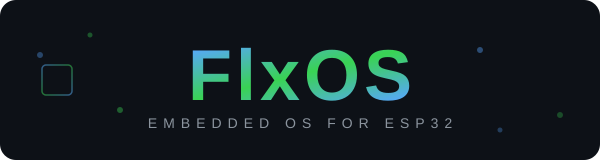

<p align="center">
  
</p>

<p align="center">
  <strong>A real operating system for ESP32 — with a desktop shell, app framework, and one-YAML hardware targeting.</strong>
</p>

<p align="center">
  <a href="https://github.com/flxos-labs/flxos/actions/workflows/build.yml"></a>
  <a href="https://github.com/flxos-labs/flxos/actions/workflows/code-quality.yml"></a>
  <a href="https://github.com/flxos-labs/flxos/releases"></a>
  <a href="LICENSE"></a>
</p>

---

## Why FlxOS?

Most ESP32 projects glue together a display driver, a menu loop, and call it done. FlxOS is different — it's a **structured operating system** with layers you'd recognize from a desktop OS, but sized for microcontrollers:

- **A real desktop shell** — status bar, app launcher, dock, notification panel, quick access panel, and swipe gesture navigation. Not a menu. A *desktop*.
- **Android-style app framework** — Apps declare manifests with capabilities, MIME handlers, URL schemes, and dependencies. Launch apps via Intents (`ACTION_VIEW`, `ACTION_EDIT`, `ACTION_SEND`). Apps can be compiled-in or loaded from SD card.
- **Service layer with dependency resolution** — Services register with manifests, declare dependencies, get auto-started in topological order at boot. Built-in health monitoring with watchdog, auto-restart, and safe-mode triggers.
- **One-YAML hardware targeting** — Write a `profile.yaml` that describes your board (SoC, display, touch, pins, SD card, battery, peripherals) and FlxOS generates the HAL initialization code. Switch boards by changing one file.
- **Publish/subscribe EventBus** — Decoupled, thread-safe communication across the entire system (`wifi.connected`, `app.started`, `sdcard.mounted`, etc.).
- **Headless mode** — Drop the display layer entirely for embedded/server use cases.

> FlxOS runs on ESP32, ESP32-S2, ESP32-S3, ESP32-C3, ESP32-C6, ESP32-H2, and ESP32-P4. Desktop platform support (Linux, macOS, Windows) is on the roadmap.

---

## Screenshots

<table>
  <tr>
    <td align="center"><br/><sub>Home screen</sub></td>
    <td align="center"><br/><sub>Home screen with dock, status bar &amp; wallpaper</sub></td>
    <td align="center"><br/><sub>Floating notification</sub></td>
  </tr>
  <tr>
    <td align="center"><br/><sub>Notification panel</sub></td>
    <td align="center"><br/><sub>Quick Access panel</sub></td>
    <td align="center"><br/><sub>App launcher</sub></td>
  </tr>
  <tr>
    <td align="center"><br/><sub>Calendar app</sub></td>
    <td align="center"><br/><sub>Files app</sub></td>
    <td align="center"><br/><sub>Settings app</sub></td>
  </tr>
  <tr>
    <td align="center"><br/><sub>Tools app</sub></td>
    <td align="center"><br/><sub>System Info (Material theme)</sub></td>
    <td align="center"><br/><sub>System Info (Hyprland dark theme)</sub></td>
  </tr>
  <tr>
    <td align="center"><br/><sub>Dynamic dwindle tiling (4 apps)</sub></td>
    <td align="center"><br/><sub>Image viewer + Files (dwindle)</sub></td>
    <td align="center"><br/><sub>Text editor + Files (dwindle)</sub></td>
  </tr>
  <tr>
    <td align="center" colspan="3"><br/><sub>Text editor with on-screen keyboard</sub></td>
  </tr>
</table>

---

## Architecture

```
┌─────────────────────────────────────────────────────────────────┐
│                        Applications                             │
│  Calendar · Files · Image Viewer · Text Editor · Settings · ... │
├─────────────────────────────────────────────────────────────────┤
│                     App Framework (Apps/)                        │
│  AppManager · AppManifest · Intent · ContentProvider · Registry │
├─────────────────────────────────────────────────────────────────┤
│                     Desktop Shell (UI/)                          │
│  WindowManager · StatusBar · Launcher · Dock                    │
│  NotificationPanel · QuickAccessPanel · SwipeManager            │
├───────────────────────┬─────────────────────────────────────────┤
│   Services            │   System Managers                       │
│  ServiceRegistry      │  Display · Power · Theme · Notification │
│  IService · Manifest  │  Settings · Time · SystemDiagnostics    │
│  HealthCheck/Watchdog │  DeviceProfile · HalInit · CLI · FS    │
├───────────────────────┴─────────────────────────────────────────┤
│                     Kernel                                      │
│  TaskManager · ResourceMonitor                                  │
├─────────────────────────────────────────────────────────────────┤
│                     Core                                        │
│  EventBus · Observable · Bundle · Logger · Preferences          │
│  GuiLock · PathUtils · ClipboardManager                         │
├─────────────────────────────────────────────────────────────────┤
│                     HAL (HalModule/)                            │
│  DeviceRegistry · BusManager · HardwareCapabilities             │
│  Display · Touch · GPIO · I2C · SPI · UART · USB · SD · GPS    │
├─────────────────────────────────────────────────────────────────┤
│              Connectivity                                       │
│  ConnectivityManager · WiFiManager · BluetoothManager · Hotspot │
├─────────────────────────────────────────────────────────────────┤
│  ESP-IDF  ·  FreeRTOS  ·  LVGL  ·  LovyanGFX                  │
└─────────────────────────────────────────────────────────────────┘
```

---

## The Profile System

Profiles are FlxOS's killer feature. Instead of `#ifdef`-spaghetti for different boards, you describe your hardware once in YAML and let the build system handle everything:

```yaml
# Profiles/esp32s3-ili9341-xpt/profile.yaml
id: esp32s3-ili9341-xpt
target: esp32s3
flash_size: 16MB
inherits: _bases/base-esp32-spi        # ← inherit common SPI defaults

hardware:
  spiram:
    enabled: true
    speed: 120M
  display:
    driver: ILI9341
    width: 240
    height: 320
    pins: { cs: 10, dc: 9, rst: 14, bckl: 7, mosi: 11, sclk: 12, miso: 13 }
  touch:
    driver: XPT2046
    pins: { cs: 5, int: 6 }
  sdcard:
    enabled: true
    cs: 4

capabilities:
  wifi: true
  bluetooth: true
  ble: true
```

**What the profile system gives you:**

| Feature | How it works |
|---|---|
| **Profile inheritance** | Base templates in `Profiles/_bases/` — override only what differs |
| **Auto HAL codegen** | `flxos.py hwgen` generates C++ device initialization from YAML |
| **Target switching** | `flxos.py select` handles `idf.py set-target`, sdkconfig, and build dir cleanup automatically |
| **Validation** | `flxos.py validate` checks profiles against `schema.yaml` (targets, flash sizes, pin conflicts, SPIRAM/flash freq sync) |
| **Profile diffing** | `flxos.py diff board-a board-b` shows exactly what changed between two configs |
| **Multi-profile CI** | `flxos.py build --all` builds every profile in sequence, reports pass/fail matrix |

### Available Profiles

| Profile | SoC | Display | Touch | Flash |
|---|---|---|---|---|
| `esp32s3-ili9341-xpt` | ESP32-S3 | ILI9341 (SPI) | XPT2046 | 16 MB |
| `cyd-2432s028r` | ESP32 | ILI9341 | Resistive | 4/8 MB |
| `lilygo-t-hmi` | ESP32-S3 | ST7789 | Capacitive | 16 MB |
| `generic-esp32` | ESP32 | — (headless) | — | 4 MB |
| `generic-esp32s3` | ESP32-S3 | — (headless) | — | 8 MB |

> **Adding your board?** Run `python flxos.py new my-board-id` to scaffold a profile, fill in pins, and you're building.

---

## Built-in Apps

| App | Description |
|---|---|
| 📅 **Calendar** | Date viewer |
| 📁 **File Manager** | Browse, copy, delete files on SD card and internal storage |
| 🖼️ **Image Viewer** | View images with MIME-type intent handling |
| 📝 **Text Editor** | Edit text files with intent-based file opening |
| ⚙️ **Settings** | System configuration |
| ℹ️ **System Info** | RAM, flash, CPU, task stats, and diagnostics |
| 🔧 **Tools** | Calculator, stopwatch, and utility collection |

Apps declare manifests with **capabilities** (WiFi, Storage, GPIO, I2C, SPI, UART), **MIME type handlers**, **URL schemes** (`flxos://settings/wifi`), and **service dependencies** — all resolved at runtime via the Intent system.

---

## Quick Start

### Prerequisites

| Requirement | Version |
|---|---|
| [ESP-IDF](https://docs.espressif.com/projects/esp-idf/en/stable/esp32/get-started/) | v5.5+ |
| Python | 3.10+ |
| CMake | 3.16+ |

```bash
# Source ESP-IDF environment
source $IDF_PATH/export.sh
```

### Build & Flash

```bash
# 1. Clone
git clone --recurse-submodules https://github.com/flxos-labs/flxos.git
cd flxos

# 2. Pick a board
python flxos.py list                          # see all profiles
python flxos.py select esp32s3-ili9341-xpt    # select one

# 3. Build
python flxos.py build

# 4. Flash
python flxos.py flash --port /dev/ttyUSB0
```

### Dev Mode

Use `--dev` for faster iteration — forces a 4 MB partition table for quicker flash cycles:

```bash
python flxos.py build --dev
```

---

## CLI Reference

`flxos.py` is the single entry point for everything:

| Command | Description |
|---|---|
| `list [--json]` | List all available profiles |
| `select <id>` | Select a profile (auto-handles target switching) |
| `build [--all] [--dev]` | Build current or all profiles |
| `validate [id]` | Validate profile YAML(s) against schema |
| `info <id>` | Show detailed profile information |
| `new <id>` | Scaffold a new profile |
| `diff <a> <b> [--json]` | Compare two profiles side-by-side |
| `hwgen [id] [--all]` | Generate HAL init code from profile YAML |
| `flash [--port]` | Flash the current build to device |
| `release <version>` | Package release artifacts |
| `cdn <version>` | Generate ESP Web Tools manifests |
| `doctor` | Check build environment health |

---

## Project Structure

```
flxos/
├── Applications/        # User-facing apps (calendar, files, settings, tools, ...)
├── Apps/                # App framework: AppManager, Intent, Manifest, Registry
├── Buildscripts/        # CMake modules, profile loader, HW code generator
├── Connectivity/        # WiFi, Bluetooth, Hotspot managers
├── Core/                # EventBus, Observable, Bundle, Logger, Preferences
├── Firmware/            # Firmware entry point and boot sequence
├── HalModule/           # Hardware Abstraction Layer (device registry, bus drivers)
├── Kernel/              # Task management and resource monitoring
├── Profiles/            # Board profiles (YAML + generated config)
│   ├── _bases/          #   Inheritable base templates
│   └── <board-id>/      #   Per-board profile.yaml + Config.hpp
├── Services/            # Service framework (registry, manifest, lifecycle)
├── System/              # System managers (display, power, theme, notifications)
├── UI/                  # Desktop shell, theming engine, LVGL components
│   ├── desktop/         #   WindowManager, StatusBar, Dock, Launcher
│   ├── theming/         #   ThemeEngine, themes, style utilities
│   └── components/      #   Reusable UI widgets (FileBrowser, etc.)
├── assets/              # Static repo assets (branding, docs images)
├── storage/             # Flash-backed partition contents for /system and /data
├── components/          # Third-party libs (LVGL, LovyanGFX — git submodules)
├── scripts/             # Dev tools (formatting, linting, naming, analysis)
├── flxos.py             # CLI build tool
└── CMakeLists.txt       # Top-level CMake project file
```

---

## Contributing

### Adding a New App

1. Create `Applications/<app-name>/` with your source files
2. Define an `AppManifest` — give it a unique ID, name, icon, category, and capabilities:

```cpp
AppManifest manifest {
    .appId        = "com.flxos.myapp",
    .appName      = "My App",
    .appIcon      = LV_SYMBOL_EDIT,
    .category     = AppCategory::Tools,
    .capabilities = AppCapability::Storage | AppCapability::WiFi,
    .supportedMimeTypes = {"text/plain"},
    .createApp    = [] { return std::make_shared<MyApp>(); }
};
```

3. Register it in `Applications/CMakeLists.txt`
4. Your app is now in the launcher, handles `text/plain` intents, and declares its resource needs

### Adding a New Service

1. Create your service implementing `IService` with lifecycle methods (`onStart`, `onStop`, `onHealthCheck`)
2. Define a `ServiceManifest` with dependencies, priority, and health-check interval
3. Register with `ServiceRegistry` — the system handles boot ordering, watchdog, and auto-restart

### Adding a New Board Profile

```bash
python flxos.py new my-board-id    # scaffolds profile.yaml
# Edit Profiles/my-board-id/profile.yaml with your pin mappings
python flxos.py validate my-board-id
python flxos.py hwgen my-board-id  # generate HAL init code
python flxos.py select my-board-id
python flxos.py build
```

### Code Quality

```bash
bash scripts/code_format.sh        # Format code (clang-format)
bash scripts/code_quality.sh       # Full quality suite
python scripts/check_naming.py     # Naming convention checks
python scripts/check_docs.py       # Documentation coverage
python scripts/analyze_complexity.py  # Cyclomatic complexity
python scripts/analyze_includes.py    # Include dependency analysis
```

---

## Third-Party Components

| Component | License | Purpose |
|---|---|---|
| [LVGL](https://github.com/lvgl/lvgl) | MIT | Graphics library and UI framework |
| [LovyanGFX](https://github.com/lovyan03/LovyanGFX) | BSD-2-Clause | Display & touch driver abstraction |

See [NOTICE](NOTICE) for full third-party license texts.

---

## CI/CD

GitHub Actions workflows run on every push and PR:

- **[build.yml](.github/workflows/build.yml)** — Multi-profile matrix build across all supported boards
- **[code-quality.yml](.github/workflows/code-quality.yml)** — Formatting, linting, naming conventions, documentation coverage, and include analysis

---

## Roadmap

- ✅ **ESP32 Embedded** — Full OS with desktop shell, app framework, service layer, HAL, and profile-driven builds
- 🔜 **Desktop Support** — Native Linux, macOS, and Windows builds (SDL2 display backend)
- 🔜 **Simulator** — Desktop-based simulator for rapid UI/app development without hardware
- 🔜 **Plugin Ecosystem** — Community-driven apps loaded from SD card (ELF loader)
- 🔜 **OTA Updates** — Over-the-air firmware updates via ESP Web Tools

---

## License

FlxOS is licensed under the **GNU Affero General Public License v3.0 (AGPL-3.0)**.
See [LICENSE](LICENSE) for the full text.
