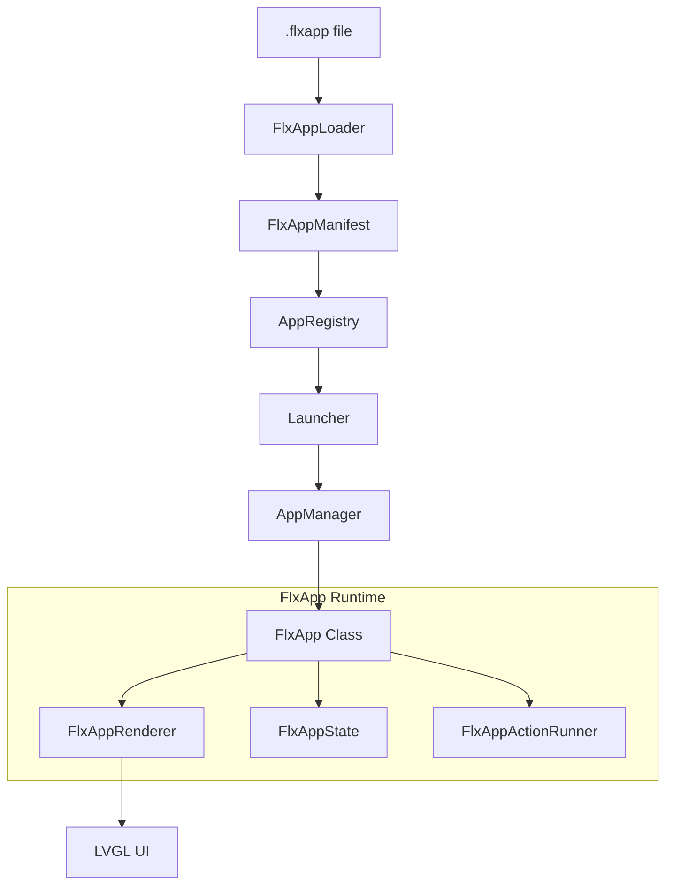

# FlxApp: YAML-Defined Declarative Apps Loaded from Storage

> **Goal**: Define apps in a YAML-based `.flxapp` format, load them at runtime from SD card or FAT filesystem, parse the YAML, and run them as first-class FlxOS apps — appearing in the launcher, using the full App lifecycle, and rendering LVGL UI from a declarative layout tree.

## Background & Design Philosophy

Today, every FlxOS app is a C++ class compiled into the firmware. The `profile.yaml` format already proves YAML is excellent for declarative configuration. This feature extends that idea to **user-space apps** — a `.flxapp` file on the SD card becomes a fully functional app with UI, metadata, lifecycle hooks, and data binding.

This is **not** a scripting engine or ELF loader. It's a **declarative UI framework** — think Android XML layouts or SwiftUI, but YAML. The C++ runtime interprets the YAML and builds real LVGL widgets. User logic is handled through **event → action** bindings (navigate, set variable, publish event, HTTP fetch, etc.).

---

## User Review Required

> [!IMPORTANT]
> **YAML vs JSON format**: The `.flxapp` files use YAML syntax (matching `profile.yaml` style you referenced). However, at runtime on ESP32, we need to parse this. Two options:
> 1. **Ship a minimal YAML parser** (e.g. [fkYAML](https://github.com/fktn-k/fkYAML) — header-only, zero dependencies, ~50KB flash)
> 2. **Use the already-bundled cJSON** and require `.flxapp` files to be JSON (rename to `.flxapp.json`) — zero new dependencies
>
> **Recommendation**: Use **fkYAML** (header-only) since you explicitly want YAML and it matches the existing `profile.yaml` aesthetic. Flash cost is ~50KB which is negligible on your 16MB flash.

---

## Phase 1: Pre-requisite Refactoring

- [ ] **Issue 1**: Implement `Launcher::rebuild()` and EventBus refresh in `Desktop.cpp`
- [ ] **Issue 2**: Implement lazy instantiation in `AppManager::startAppForResultImpl()`
- [ ] **Issue 3**: Fix `AppManager::getInstalledApps()` thread safety (return by value + mutex)
- [ ] **Issue 4**: Deduplicate indexing between `AppRegistry` and `AppManager`
- [ ] **Issue 5**: Remove legacy `m_eventCallback` from `ServiceRegistry`

### Details: Issue 1: Launcher Never Refreshes (BLOCKER)

**Problem**: `Launcher::create()` iterates `AppManager::getInstalledApps()` **once** in the constructor and builds a static list of buttons. If FlxApps are loaded after boot, they will never appear in the launcher.

**Fix**:
1. Add a `rebuild()` method to `Launcher` that clears `m_list`, re-queries `AppManager::getInstalledApps()`, and re-creates all buttons.
2. Subscribe to `EventBus` events `app.installed` / `app.uninstalled` from Desktop to trigger `rebuild()`.

#### [MODIFY] [Launcher.hpp](file:///home/akash/flxos-labs/flxos/UI/Include/flx/ui/desktop/modules/launcher/Launcher.hpp)
#### [MODIFY] [Launcher.cpp](file:///home/akash/flxos-labs/flxos/UI/Source/desktop/modules/launcher/Launcher.cpp)
#### [MODIFY] [Desktop.cpp](file:///home/akash/flxos-labs/flxos/UI/Source/desktop/Desktop.cpp)

### Details: Issue 2: AppManager Eagerly Instantiates All Apps (OPTIMIZATION)

**Problem**: `AppManager::init()` calls `manifest.createApp()` for **every** registered manifest at boot. Wasteful for memory-constrained ESP32.

**Fix**: Move instantiation to `startAppForResultImpl()` (lazy, on-demand).

#### [MODIFY] [AppManager.cpp](file:///home/akash/flxos-labs/flxos/Apps/Source/AppManager.cpp)

### Details: Issue 3: `getInstalledApps()` Returns an Unguarded Reference (THREAD SAFETY BUG)

**Problem**: Returns a `const std::vector<...>&` to internal `m_apps` without holding a mutex. Data race with `registerApp()`.

**Fix**: Change signature to return by value (snapshot) under mutex.

#### [MODIFY] [AppManager.hpp](file:///home/akash/flxos-labs/flxos/Apps/Include/flx/apps/AppManager.hpp)
#### [MODIFY] [AppManager.cpp](file:///home/akash/flxos-labs/flxos/Apps/Source/AppManager.cpp)

### Details: Issue 4: AppRegistry and AppManager Redundant Indexing

**Problem**: Every built-in app is registered in **both** `AppRegistry` and `AppManager`. Lazy instantiation makes `AppManager::m_apps` a cache of live instances, but Registry should remain the metadata source of truth.

**Fix**: `AppManager` only tracks **live instances**. `SystemDiagnostics` queries `AppRegistry` for total catalog.

#### [MODIFY] [AppManager.cpp](file:///home/akash/flxos-labs/flxos/Apps/Source/AppManager.cpp)
#### [MODIFY] [SystemDiagnostics.cpp](file:///home/akash/flxos-labs/flxos/System/Source/SystemDiagnostics.cpp)

### Details: Issue 5: ServiceRegistry Legacy Callback Removal

**Problem**: `m_eventCallback` is dead code superseded by `EventBus`.

**Fix**: Remove `m_eventCallback`, `setEventCallback()`, and the branch in `publishServiceEvent()`.

#### [MODIFY] [ServiceRegistry.hpp](file:///home/akash/flxos-labs/flxos/Services/Include/flx/services/ServiceRegistry.hpp)
#### [MODIFY] [ServiceRegistry.cpp](file:///home/akash/flxos-labs/flxos/Services/Source/ServiceRegistry.cpp)

---

## Phase 2: Core Infrastructure & YAML Integration

- [ ] **fkYAML Integration**: Add `Libraries/fkyaml` as a header-only library
- [ ] **Constants & Events**: Define `FLXAPP_LOADER_READY`, `FLXAPP_LOADED` in `EventBus.hpp`
- [ ] **Manifest & Location**: Verify `AppLocation` compatibility with runtime-parsed paths

#### [NEW] Libraries/fkyaml (git submodule or vendored header)
- Add [fkYAML](https://github.com/fktn-k/fkYAML) single-header include (~50KB flash).

#### [MODIFY] [EventBus.hpp](file:///home/akash/flxos-labs/flxos/Core/Include/flx/core/EventBus.hpp)
- Add event constants for FlxApp lifecycle.

---

## Phase 3: FlxApp Runtime Engine

- [ ] **FlxAppManifest**: Metadata parsing (id, name, version, icon, etc.)
- [ ] **FlxAppState**: Reactive variable store with `{{template}}` resolution
- [ ] **FlxAppRenderer**: YAML → LVGL bridge
- [ ] **FlxAppActionRunner**: Event → Action binder
- [ ] **FlxApp Base Class**: Concrete implementation of `flx::apps::App`
- [ ] **FlxAppLoader**: Recursive scanner for SD and Internal storage

### Core Component Breakdown:

#### [NEW] FlxApp/Include/flx/flxapp/FlxAppManifest.hpp
Parsed metadata from YAML `app:` section (id, name, version, icon, permissions).

#### [NEW] FlxApp/Include/flx/flxapp/FlxAppState.hpp
Reactive store for `variables:` section. Supports typed storage (int, string, bool) and template resolution (e.g. `resolve("Count: {{counter}}")`).

#### [NEW] FlxApp/Include/flx/flxapp/FlxAppRenderer.hpp
The YAML-to-LVGL mapper. Walks the `ui:` tree and creates native widgets (column, row, label, button, etc.).

#### [NEW] FlxApp/Include/flx/flxapp/FlxAppActionRunner.hpp
Executes logic (increment, toggle, notify, event_publish, navigate) triggered by UI events.

#### [NEW] FlxApp/Include/flx/flxapp/FlxApp.hpp
Runtime app class owning the State, Renderer, and ActionRunner.

#### [NEW] FlxApp/Include/flx/flxapp/FlxAppLoader.hpp
Handles directory scanning (`/sdcard/apps/`, `/data/apps/`) and registration into `AppRegistry`.

#### [NEW] FlxApp/CMakeLists.txt
```cmake
idf_component_register(
    SRCS "Source/FlxApp.cpp" "Source/FlxAppLoader.cpp" ...
    INCLUDE_DIRS Include
    REQUIRES Core Apps System Services
    PRIV_REQUIRES lvgl json
)
```

---

## Phase 4: Widget & Action Implementation

- [ ] **Basic Widgets**: Column, Row, Label, Button, Spacer
- [ ] **Input Widgets**: Text Input, Switch, Slider, Checkbox, Dropdown
- [ ] **Display Widgets**: Image, List, Bar
- [ ] **Core Actions**: Increment, Decrement, Set, Toggle, Log, Notify, Event Publish, Navigate, Close, HTTP Get

---

## Phase 5: System Integration & Hot-Loading

- [ ] **Boot Scanning**: Initialize `FlxAppLoader` in `SystemManager.cpp` after storage is ready
- [ ] **Hot-Loading**: Subscribe to `sdcard.mounted` to trigger re-scan
- [ ] **Hot-Unloading**: Handle `sdcard.unmounted` to gracefully remove apps

#### [MODIFY] [SystemManager.cpp](file:///home/akash/flxos-labs/flxos/System/Source/SystemManager.cpp)
- Call `FlxAppLoader::getInstance().scanAndRegister()` during boot.
- Listen for SD mount events for dynamic updates.

---

## Phase 6: Verification & Examples

- [ ] **Hello World**: Deploy `hello.flxapp` to `/data/apps/`
- [ ] **System Monitor**: Deploy `sysmon.flxapp` to `/sdcard/apps/`
- [ ] **Stress Test**: Verify memory behavior with multiple FlxApps loaded
- [ ] **Build Check**: Ensure `idf.py build` succeeds

#### [NEW] storage/data/apps/hello.flxapp
Basic greeting app with counter and text input.

#### [NEW] storage/data/apps/sysmon.flxapp
System monitor showing heap, uptime, and WiFi info via reactive bindings.

---

## Storage & Implementation Details

### Storage Convention
- `/sdcard/apps/*.flxapp` (Single-file apps)
- `/sdcard/apps/*/app.flxapp` (Apps with assets)
- `/data/apps/` (Internal storage apps)

### File Summary Table

| File | Status | Purpose |
|------|--------|---------|
| `Libraries/fkyaml/` | NEW | Header-only YAML parser |
| `FlxApp/Include/flx/flxapp/FlxApp.hpp` | NEW | Runtime app class |
| `FlxApp/Include/flx/flxapp/FlxAppLoader.hpp` | NEW | Scanner + registration |
| `FlxApp/Include/flx/flxapp/FlxAppManifest.hpp` | NEW | YAML metadata |
| `FlxApp/Include/flx/flxapp/FlxAppState.hpp` | NEW | Reactive variables |
| `FlxApp/Include/flx/flxapp/FlxAppRenderer.hpp` | NEW | YAML -> UI bridge |
| `FlxApp/Include/flx/flxapp/FlxAppActionRunner.hpp` | NEW | Event logic |
| `CMakeLists.txt` | MODIFY | Add component to build |
| `SystemManager.cpp` | MODIFY | Boot/SD scan trigger |
| `EventBus.hpp` | MODIFY | App load events |

---

## Architecture Overview



---

## Verification Plan

### Automated Tests
1. `idf.py build` — confirm zero errors.
2. Verify app appears in Launcher on SD mount.
3. Verify variable binding in `hello.flxapp`.

### Manual Verification
1. **Hot-load**: SD insert discovery.
2. **Graceful failure**: Malformed YAML handling.
